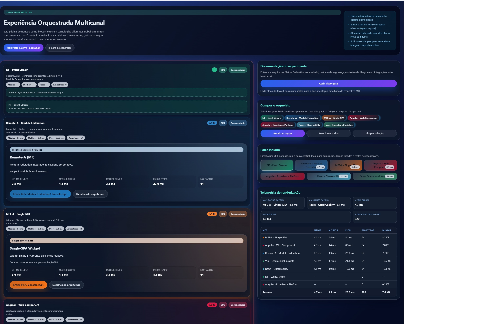



# MFF LABS • Native Federation Lab (ESM + Design System + Telemetria)

Este laboratório demonstra como orquestrar múltiplos Micro Front‑Ends (MFEs) de stacks diferentes (Angular, React, Vue, Module Federation, Single‑SPA e ESM nativo) usando Native Federation com ES Modules, import maps, CSP rigorosa e telemetria unificada. 

O shell é totalmente estático (sem bundler), aplica um Design System compartilhado por tokens CSS e expõe documentação embarcada, métricas de renderização e um BUS simples de eventos entre MFEs.

## Sumário

- [Visão geral](#visão-geral)
- [Arquitetura do laboratório](#arquitetura-do-laboratório)
- [Por que Native Federation?](#por-que-native-federation)
- [Tecnologias e decisões](#tecnologias-e-decisões)
  - [ES Modules + Import Maps](#es-modules--import-maps)
  - [esbuild](#esbuild)
  - [CSP e CORS](#csp-e-cors)
  - [Design System (tokens CSS)](#design-system-tokens-css)
  - [Telemetria](#telemetria)
  - [Lifecycle unificado (mount/update/unmount)](#lifecycle-unificado-mountupdateunmount)
  - [BUS (comunicação simples)](#bus-comunicação-simples)
- [Estrutura de pastas](#estrutura-de-pastas)
- [Execução a partir da raiz](#execução-a-partir-da-raiz)
  - [Build Angular Full](#build-angular-full)
  - [Servir MFEs nas portas padrão](#servir-mfes-nas-portas-padrão)
  - [Servir o Shell](#servir-o-shell)
  - [Servir uma pasta de build diretamente](#servir-uma-pasta-de-build-diretamente)
- [Expor publicamente em HTTPS (sem conta)](#expor-publicamente-em-https-sem-conta)
  - [LocalTunnel](#localtunnel)
  - [Cloudflared (trycloudflare)](#cloudflared-trycloudflare)
  - [Ajustes temporários de CSP](#ajustes-temporários-de-csp)
- [Operação e UX](#operação-e-ux)
- [Dicas e troubleshooting](#dicas-e-troubleshooting)
- [Licença](#licença)

---

## Visão geral

- Shell estático (`native-federation-shell-angular/`) serve HTML/CSS/JS diretamente como ESM.
- MFEs diversos são carregados sob demanda via `import()` com endpoints HTTP próprios, cada qual com seu pipeline e stack.
- Design System central em CSS define tokens, cores por tecnologia e componentes base (botões, badges, cartões), consumidos por todos os MFEs (inclusive em Shadow DOM).
- Telemetria de renderização: o shell mede tempo de montagem, calcula média, melhor/pior pico e exibe um ranking com tamanhos de bundle por MFE.
- Documentação “para leigos” embarcada (modais) explica a arquitetura, segurança, operação e instruções de execução/exposição pública.

## Arquitetura do laboratório

- Shell (estático, ESM) + Import Map + CSP + DS + Telemetria + BUS
- MFEs:
  - Native Federation (ESM puro)
  - Module Federation (remote webpack 5, consumido como ESM)
  - Single‑SPA (adapter)
  - Angular (Web Component standalone)
  - Angular Full (CLI completo empacotado em `dist-webcomponent/`)
  - React (Custom Element)
  - Vue (Custom Element)
- Integração por “slots”: o shell seleciona quais MFEs entram no “mock” de página e qual assume o “palco”.

## Por que Native Federation?

- Independência entre times: cada MFE evolui no seu ritmo sem efeito cascata.
- Sem bundler compartilhado: menor acoplamento entre projetos e builds mais previsíveis.
- Carregamento sob demanda: carrega apenas o que precisa, quando precisa.
- Observabilidade simples: telemetria unificada e BUS para integração de eventos.
- Segurança: CSP rígida, CORS controlado e desmontagem limpa (sem vazamentos).
- Escalável: convive bem com projetos existentes (Module Federation, Single‑SPA), ajudando na migração gradual.

## Tecnologias e decisões

### ES Modules + Import Maps
- O shell consome MFEs como ESM nativos via `import()`, sem runtime/bundler compartilhado.
- Import Maps reduzem ambiguidade de dependências no shell e explicitam endpoints permitidos.

### esbuild
- Builds rápidos e simples, especialmente para Angular CLI recente e pipelines de bundling minimalistas.
- Menor sobrecarga de configuração, mais velocidade de iteração.

### CSP e CORS
- CSP (Content‑Security‑Policy) rigorosa restringe `script-src`, `style-src`, `connect-src` etc.
- Sem estilos inline: todo estilo vem por classes/variáveis CSS. Isso reduz riscos e facilita auditoria.
- CORS é configurado para permitir somente o shell como origem consumidora dos MFEs.

### Design System (tokens CSS)
- `native-federation-shell-angular/design-system.css`: tokens, cores por tecnologia e componentes base.
- Tokens principais: 
  - Cores neutras (`--ds-color-*`), sombras (`--ds-shadow-*`), raios (`--ds-radius-*`)
  - Tipografia, espaçamentos, altura e borda de botões, `--ds-accent`
  - Mapa de acentos por tecnologia: `--ds-tech-nf`, `--ds-tech-mf`, `--ds-tech-ssa`, `--ds-tech-ng`, `--ds-tech-ng-full`, `--ds-tech-react`, `--ds-tech-vue`
- MFEs consomem somente `var(--ds-*)`, sem depender do CSS do shell, preservando encapsulamento.

### Telemetria
- Shell mede tempos de montagem por MFE:
  - média, último, melhor, pior, quantidade de amostras.
- Ranking: tabela ordenada por média, com colunas de tamanho de bundle (KB/MB).
- Agregados globais: média global, melhor/pior pico e total de amostras.

### Lifecycle unificado (mount/update/unmount)
- Contrato padrão: cada MFE deve retornar algo que permita desmontagem limpa (destroy/teardown/unmount).
- Shell sempre desmonta antes de montar de novo, evitando vazamentos de listeners/DOM.

### BUS (comunicação simples)
- “Fio de comunicação” por eventos. Em vez de chamar diretamente outro MFE, um bloco publica um aviso (evento), e quem se interessar escuta e reage.
- Benefício: baixa dependência entre MFEs, comunicação clara e extensível.

## Estrutura de pastas

```
MFF LABS/
├─ native-federation-shell-angular/
│  ├─ index.html
│  ├─ app.js
│  ├─ styles.css
│  └─ design-system.css
└─ MFEs/
   ├─ angular/
   │  ├─ mfe-ng/
   │  └─ mfe-ng-full/ (gera dist-webcomponent/)
   ├─ module-federation/remote-a/
   ├─ native-federation/mfe1/
   ├─ react/mfe-react/
   ├─ single-spa/mfe-a/
   └─ vue/mfe-vue/
```

## Execução a partir da raiz

Os comandos abaixo assumem que você está na raiz do repositório.

### 1) Instalação (uma vez)

```bash
# Use npm workspaces se preferir; como fallback, cada pasta faz npm install
npm run -w MFEs/angular/mfe-ng-full        ci || (cd MFEs/angular/mfe-ng-full        && npm install)
npm run -w MFEs/angular/mfe-ng             ci || (cd MFEs/angular/mfe-ng             && npm install)
npm run -w MFEs/module-federation/remote-a ci || (cd MFEs/module-federation/remote-a && npm install)
npm run -w MFEs/native-federation/mfe1     ci || (cd MFEs/native-federation/mfe1     && npm install)
npm run -w MFEs/react/mfe-react            ci || (cd MFEs/react/mfe-react            && npm install)
npm run -w MFEs/single-spa/mfe-a           ci || (cd MFEs/single-spa/mfe-a           && npm install)
npm run -w MFEs/vue/mfe-vue                ci || (cd MFEs/vue/mfe-vue                && npm install)
npm run -w native-federation-shell-angular ci || (cd native-federation-shell-angular && npm install)
```

### Build Angular Full

```bash
cd MFEs/angular/mfe-ng-full
npm run package
# Artefatos em: MFEs/angular/mfe-ng-full/dist-webcomponent/
```

### Servir MFEs nas portas padrão

Abrir cada um em um terminal (ou use PM2/npm-run-all):

```bash
# Native Federation (mfe1) - 9201
cd MFEs/native-federation/mfe1 && npm start

# Module Federation (remote-a) - 9101
cd MFEs/module-federation/remote-a && npm start

# Single-SPA (mfe-a) - 9001
cd MFEs/single-spa/mfe-a && npm start

# Angular Web Component (mfe-ng) - 9310
cd MFEs/angular/mfe-ng && npm start

# Angular Full (dist-webcomponent) - 9400
cd MFEs/angular/mfe-ng-full && npm run serve
# React (mfe-react) - 9302
cd MFEs/react/mfe-react && npm start

# Vue (mfe-vue) - 9303
cd MFEs/vue/mfe-vue && npm start
```

### Servir o Shell

```bash
cd native-federation-shell-angular && npm start
# Shell em http://localhost:9200
```

### Servir uma pasta de build diretamente

Qualquer pasta estática (ex.: Angular Full `dist-webcomponent/`) pode ser servida com:

```bash
npx serve -l 9400 MFEs/angular/mfe-ng-full/dist-webcomponent
```

## Expor publicamente em HTTPS (sem conta)

Para permitir acesso externo (internet), use um túnel público.

### LocalTunnel

Gera URL https sem cadastro:

```bash
# Shell
npx localtunnel --port 9200 --subdomain mff-shell

# MFEs (um por terminal)
npx localtunnel --port 9201 --subdomain mff-nf
npx localtunnel --port 9101 --subdomain mff-mf
npx localtunnel --port 9001 --subdomain mff-ssa
npx localtunnel --port 9310 --subdomain mff-ng
npx localtunnel --port 9400 --subdomain mff-ngfull
npx localtunnel --port 9302 --subdo
main mff-react
npx localtunnel --port 9303 --subdomain mff-vue
```

- Copie as URLs geradas e, se necessário, ajuste temporariamente os remotes e a CSP do shell para permitir `https://*.loca.lt`.

### Cloudflared (trycloudflare)

URLs https públicas, sem login no modo rápido:

```bash
# Instale se ainda não tiver:
# Windows: choco install cloudflared
# macOS:   brew install cloudflare/cloudflare/cloudflared

# Shell
cloudflared tunnel --url http://localhost:9200

# MFEs (um por terminal)
cloudflared tunnel --url http://localhost:9201
cloudflared tunnel --url http://localhost:9101
cloudflared tunnel --url http://localhost:9001
cloudflared tunnel --url http://localhost:9310
cloudflared tunnel --url http://localhost:9400
cloudflared tunnel --url http://localhost:9302
cloudflared tunnel --url http://localhost:9303
```

- Ajuste remotes/CSP para `https://*.trycloudflare.com` enquanto publicar.

### Ajustes temporários de CSP

No `native-federation-shell-angular/index.html`, a meta CSP já lista hosts locais. Para testes públicos, inclua os domínios dos túneis em `script-src`, `connect-src` e `style-src` (se necessário):

```html
<meta http-equiv="Content-Security-Policy"
  content="
    default-src 'self';
    script-src   'self' https://*.loca.lt https://*.trycloudflare.com ...;
    connect-src  'self' https://*.loca.lt https://*.trycloudflare.com ...;
    style-src    'self' 'unsafe-hashes' ...; 
    img-src 'self' data:;
    font-src 'self';
    base-uri 'self';
    form-action 'self';
    object-src 'none';
" />
```

> Importante: Mantenha a política rígida; evitamos `style` inline e preferimos tokens CSS. Ajustes são apenas para permitir os hosts dos túneis.

## Operação e UX

- “Compor o esqueleto”: selecione os MFEs que aparecem no layout mockado.
- “Palco isolado”: escolha um MFE para demonstrar em foco (útil para depuração/POCs).
- Documentação: cada card tem um botão “Documentação”; há também o “Manifesto”.
- BUS e Telemetria: cada card tem botão “BUS”; ranking mostra médias e tamanhos de bundle.
- Acessibilidade: modais com foco/ESC, foco visível, sem estilos inline (CSP friendly).

## Dicas e troubleshooting

- Se algum MFE não carregar: verifique se a porta está ativa e se a CSP permite o host.
- Cachê de CSS em custom elements (Shadow DOM): fizemos injeção/consumo de tokens para evitar problemas. Forçar recarregamento (Ctrl+F5) ajuda.
- Stats inconsistentes: a média é incremental; troque MFEs de lugar para coletar amostras novamente.
- Publicação: certifique-se de expor o shell e todos os remotes públicas ao mesmo tempo (mesmos túneis ou similares).

## Licença

Uso interno para experimentação/POCs. Ajuste conforme sua política.

---

Feito com foco em: isolamento leve, segurança, performance e clareza para quem não é especialista — mantendo integração real com múltiplos frameworks sem gambiarras.
