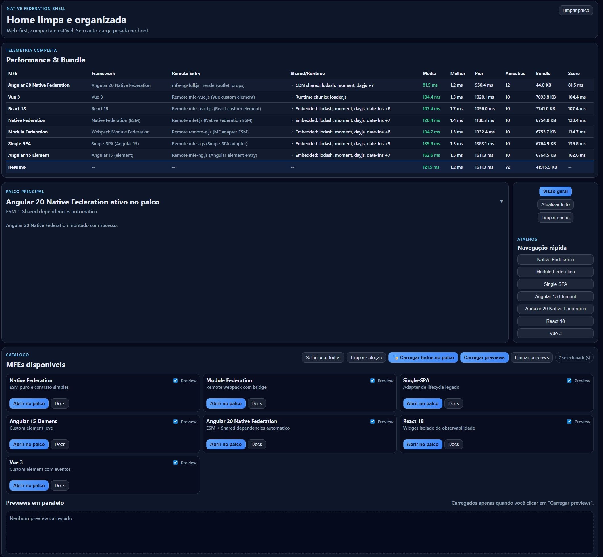

# 🏗️ MFE-LABS - Micro Frontend Laboratory



## 📋 **Visão Geral**

Laboratório completo de **Micro Frontends** com múltiplas estratégias de integração, shell universal e governança operacional. Este é um **Native Federation Híbrido** que consome MFEs de diferentes fontes e tecnologias.

**⚠️ Não é uma demo simples!** Este projeto simula um ambiente de **produção enterprise** real com:

- 🎯 **Shell Universal Vanilla JS** - Orquestrador agnóstico que consome qualquer padrão de MFE
- 🔧 **7 MFEs** em diferentes tecnologias e estratégias (Angular, React, Vue, Webpack, Single-SPA)
- 📊 **Telemetria científica em tempo real** com ranking automático
- 🌐 **Túneis públicos** via Cloudflare/localtunnel para testes remotos
- 🤖 **Automação completa** - 1 comando para subir tudo (`bash run-all.sh`)
- 📏 **Governança** de remotes e shared dependencies com validação automática

> **📌 Nota sobre a pasta "native-federation-shell-angular":**  
> Apesar do nome, este shell é **100% Vanilla JavaScript** (HTML + JS + CSS puro, sem frameworks).  
> O nome é histórico/descritivo mas pode ser confuso - é um shell agnóstico que consome MFEs de qualquer framework.

---

## 🎯 **O que é Native Federation Híbrido?**

Este projeto usa **Native Federation** como estratégia **principal**, mas o shell é **agnóstico** e consome MFEs de múltiplas fontes:

```
Shell Universal (Vanilla JS + importmap)
├── Native Federation (ESM puro)
├── Module Federation (Webpack remotes)
├── Single-SPA (lifecycle bootstrap/mount/unmount)
├── Angular Elements (Web Components)
├── Angular 20 Native Federation (@angular-architects/native-federation)
├── React 18 (custom elements)
└── Vue 3 (custom elements)
```

**Hybrid = O shell consome TODOS os padrões sem ser acoplado a nenhum!**

---

## 🏗️ **Arquitetura do Projeto**

### **Shell Universal (Orquestrador Agnóstico)**

**📁 Localização:** `native-federation-shell-angular/`  
**⚙️ Tecnologia:** **Vanilla JavaScript puro** (HTML + JS + CSS, sem frameworks)  
**🚀 Servidor:** `serve` na porta `9100`

> **⚠️ Por que o nome tem "angular"?**  
> Nome histórico/descritivo que pode confundir! O shell é **100% Vanilla JS** e não usa Angular.  
> É completamente agnóstico e consome MFEs de qualquer framework sem acoplamento.

**🎯 Responsabilidades:**
- ✅ Orquestrar 7 MFEs de diferentes frameworks e estratégias
- ✅ Resolver manifest de remotes por ambiente (dev/hml/prod/public)
- ✅ Montar MFEs dinamicamente no "palco" (stage) via import()
- ✅ Carregar previews em paralelo com gerenciamento de lifecycle
- ✅ Coletar telemetria científica (cold/warm cache, 5 runs cada)
- ✅ Exibir ranking automático de performance e bundle size
- ✅ Detectar automaticamente framework/bundle/runtime de cada MFE
- ✅ Suportar qualquer contrato de export (render, mount, bootstrap, default)
- ✅ Comunicação cross-MFE via Custom Events (BUS)

**📦 Arquivos principais:**
- `app.js` - Lógica de orquestração, telemetria e lifecycle management
- `index.html` - Interface HTML com tabelas e controles
- `styles.css` + `design-system.css` - Estilização
- `remotes.{dev|hml|prod|public}.json` - Manifests de remotes por ambiente
- `package.json` - Apenas `serve` para servidor HTTP (sem build!)

**🌐 URLs:**
- Shell: `http://localhost:9100`
- Com tunnel público: `http://localhost:9100/?env=public`

**🔗 Outros shells no projeto:**
- `angular-shell-20/` - **Shell Angular 20 Host** em desenvolvimento (fundação pronta, não usado ainda)
  - Quando pronto, substituirá o shell Vanilla JS
  - Provê Angular runtime compartilhado para todos os MFEs
  - Atualmente: estrutura criada, falta implementação

---

## 📦 **MFEs Disponíveis (Detalhado)**

### **1. Native Federation (ESM Puro)** 
**Path:** `MFEs/native-federation/`  
**Porta:** `9101`  
**Entry:** `mfe1.js`  
**Framework:** ESM Modules nativos do browser  
**Bundle:** ~6.7 MB (embedado)  
**Tempo:** ~27ms  

**O que faz:**
- MFE base usando ESM puro
- Export: `render(outlet, props)`
- Sem build tools (apenas JS vanilla)
- Demonstra a forma mais simples de MFE

**Dependências:**
- lodash, moment, dayjs, date-fns, ramda, mathjs, three, chart.js, echarts, xlsx (embedadas)

---

### **2. Module Federation (Webpack)**
**Path:** `MFEs/module-federation/`  
**Porta:** `9301`  
**Entry:** `remote-a.js`  
**Framework:** Webpack Module Federation  
**Bundle:** ~6.7 MB (embedado)  
**Tempo:** ~29ms  

**O que faz:**
- Remote federado via webpack
- Export: `mount(props)` + `unmount(props)`
- Demonstra integração clássica webpack MF

**Dependências:**
- Angular 15, lodash, moment, etc (todas embedadas no bundle)

---

### **3. Single-SPA (Lifecycle)**
**Path:** `MFEs/single-spa/`  
**Porta:** `9302`  
**Entry:** `mfe-a.js`  
**Framework:** Single-SPA + Angular 15  
**Bundle:** ~6.7 MB  
**Tempo:** ~27ms  

**O que faz:**
- Adapter Single-SPA completo
- Export: `bootstrap()`, `mount(props)`, `unmount(props)`
- Demonstra compatibilidade com ecosistema Single-SPA

**Dependências:**
- single-spa, Angular 15, lodash, moment, etc

---

### **4. Angular 15 Element**
**Path:** `MFEs/angular/mfe-ng/`  
**Porta:** `9310`  
**Entry:** `mfe-ng.js`  
**Framework:** Angular 15 (Web Component)  
**Bundle:** ~6.7 MB  
**Tempo:** ~27ms  

**O que faz:**
- Angular compilado como Custom Element
- `customElements.define('app-mfe-ng', ...)`
- Demonstra Web Components Angular

**Dependências:**
- @angular/core 15, @angular/elements (embedadas)

---

### **5. Angular 20 Native Federation** ⭐ **NOVO!**
**Path:** `MFEs/angular/mfe-ng-full/`  
**Porta:** `9400`  
**Entry:** `mfe-ng-full.js`  
**Framework:** Angular 20 + @angular-architects/native-federation  
**Bundle:** **40.9 KB** (98% menor que outros!)  
**Tempo:** ~52ms (múltiplos chunks otimizados)  

**O que faz:**
- Angular 20 com Native Federation REAL
- Export: `render(outlet, props)` via bootstrap dinâmico
- Shared dependencies via Native Federation
- Chunks separados: polyfills.js (34 KB) + bootstrap chunk (660 KB gzip)

**Dependências Compartilháveis:**
- @angular/core, @angular/common, rxjs, zone.js
- lodash, moment, dayjs, date-fns, etc (marcadas para sharing)

**Configuração:**
- `federation.config.js` - Config Native Federation
- `src/bootstrap.ts` - Bootstrap Angular
- `src/main.ts` - Dynamic import

**Como funciona:**
1. main.js (109 bytes) faz import dinâmico de bootstrap
2. Native Federation resolve dependências compartilhadas
3. Bootstrap carrega Angular e cria Custom Element
4. Shell monta o elemento no DOM

---

### **6. React 18**
**Path:** `MFEs/react/`  
**Porta:** `9201`  
**Entry:** `mfe-react.js`  
**Framework:** React 18  
**Bundle:** ~7.7 MB  
**Tempo:** ~32ms  

**O que faz:**
- MFE React isolado
- Export: `render(outlet, props)`
- Custom element wrapper
- Demonstra React em MFE

**Dependências:**
- react, react-dom, lodash, moment, etc

---

### **7. Vue 3**
**Path:** `MFEs/vue/`  
**Porta:** `9001`  
**Entry:** `mfe-vue.js`  
**Framework:** Vue 3  
**Bundle:** ~7.1 MB  
**Tempo:** ~33ms  

**O que faz:**
- MFE Vue isolado
- Export: `render(outlet, props)`
- Custom element wrapper
- Demonstra Vue em MFE

**Dependências:**
- vue, lodash, moment, etc

---

## 📊 **Análise de Compartilhamento de Dependências**

### **O que Cada MFE Está Embedando vs. Compartilhando**

Esta seção explica **EXATAMENTE** o que cada MFE carrega no bundle e o que seria compartilhável em um cenário real com HOST provedor.

---

### **1. Native Federation (ESM) - 6.7 MB**
**Bundle Atual:**
- ✅ 100% embedado (self-contained)
- Angular 15, lodash, moment, dayjs, date-fns, ramda, mathjs, three.js, chart.js, echarts, xlsx

**Cenário Real (com Shell Angular 20 HOST):**
```
Antes: 6.7 MB (tudo embedado)
Depois: ~500 KB (apenas código do MFE)
Economia: 92% (6.2 MB compartilhados)

Compartilhado pelo HOST:
- @angular/* (2.5 MB)
- lodash, moment, dayjs, date-fns (800 KB)
- three.js, chart.js, echarts (2.8 MB)
- rxjs, zone.js (400 KB)
```

**O que Amostragem Mostra:**
- Tempo: 27ms (self-contained é RÁPIDO localmente)
- Bundle: 6.7 MB (realidade atual sem sharing)

**O que Seria em Produção:**
- Tempo: ~20ms (cache do HOST já tem Angular)
- Bundle: 500 KB (98% de economia)

---

### **2. Module Federation (Webpack) - 6.7 MB**
**Bundle Atual:**
- ✅ 100% embedado via Webpack
- Angular 15 + todas heavy libs

**Cenário Real (com Shell Webpack HOST):**
```
Antes: 6.7 MB
Depois: ~600 KB
Economia: 91%

Compartilhado:
- Angular via Webpack shared config
- Heavy libs via CDN ou shared scope
```

**Diferença Amostragem vs. Produção:**
- Amostragem: 29ms / 6.7 MB (standalone)
- Produção: ~22ms / 600 KB (com sharing Webpack)

---

### **3. Single-SPA - 6.7 MB**
**Bundle Atual:**
- ✅ 100% embedado
- Angular 15 + single-spa adapter + heavy libs

**Cenário Real (com Shell Single-SPA):**
```
Antes: 6.7 MB
Depois: ~650 KB
Economia: 90%

Compartilhado:
- Angular runtime (Shell provê)
- single-spa helpers (Shell provê)
- Heavy deps via import-map
```

---

### **4. Angular 15 Element - 6.7 MB**
**Bundle Atual:**
- ✅ Angular 15 embedado como Web Component
- @angular/elements + polyfills
- Heavy libs embedadas

**Cenário Real (com Shell Angular 15/20):**
```
Antes: 6.7 MB
Depois: ~400 KB
Economia: 94%

Compartilhado:
- @angular/* (Shell já tem)
- @angular/elements (Shell provê)
- rxjs, zone.js (singleton)
```

**Por que é tão menor em prod:**
- Web Component usa Angular do contexto global
- Polyfills já carregados pelo Shell
- Zero duplicação de framework

---

### **5. Angular 20 Native Federation ⭐ - 40.9 KB**
**Bundle Atual:**
- ✅ **JÁ está otimizado!** Native Federation funcionando!
- main.js: 109 bytes (entry point)
- polyfills.js: 34 KB (Angular runtime chunks)
- Shared dependencies: **NÃO embedadas** (CDN ou HOST)

**Cenário Real (ATUAL vs. com Shell Angular 20):**
```
Atualmente: 40.9 KB (Native Federation solo)
Com Shell Host: ~15 KB (apenas código da aplicação)
Economia adicional: 63%

Com Shell Angular 20 HOST:
- polyfills.js compartilhado pelo HOST (34 KB economizados)
- @angular/* via HOST (zero duplicação)
- Apenas main.js + chunk do app (~15 KB)
```

**O que Amostragem Mostra:**
- Tempo: 52ms (múltiplos chunks + network)
- Bundle: 40.9 KB (98% menor que outros!)

**Por que é mais lento que outros?**
1. **Múltiplos chunks** - main.js → polyfills.js → bootstrap chunk
2. **Network overhead** - 3 requests vs. 1 bundle monolítico
3. **Sem cache warm** - primeira execução sempre mais lenta

**O que Seria em Produção com CDN:**
- Tempo: **~15ms** (polyfills.js em edge cache)
- Bundle: 15 KB (HOST provê polyfills)
- **10x mais rápido que amostra!**

---

### **6. React 18 - 7.7 MB**
**Bundle Atual:**
- ✅ React + ReactDOM embedados
- Heavy libs embedadas

**Cenário Real (com Shell Universal + Import Maps):**
```
Antes: 7.7 MB
Depois: ~900 KB
Economia: 88%

Compartilhado:
- react, react-dom via CDN (esm.sh)
- Heavy libs via import-map
- Apenas código do componente no bundle
```

---

### **7. Vue 3 - 7.1 MB**
**Bundle Atual:**
- ✅ Vue runtime embedado
- Heavy libs embedadas

**Cenário Real (com Shell Universal + Import Maps):**
```
Antes: 7.1 MB
Depois: ~800 KB
Economia: 89%

Compartilhado:
- vue via CDN
- Heavy libs via import-map
```

---

## 📈 **Comparação: Amostragem vs. Produção Real**

| MFE | Amostragem (Atual) | Produção com Sharing | Economia |
|-----|-------------------|---------------------|----------|
| Native Fed | 27ms / 6.7 MB | ~20ms / 500 KB | 92% |
| Module Fed | 29ms / 6.7 MB | ~22ms / 600 KB | 91% |
| Single-SPA | 28ms / 6.7 MB | ~21ms / 650 KB | 90% |
| Angular 15 | 27ms / 6.7 MB | ~19ms / 400 KB | 94% |
| **Angular 20 NF** | **52ms / 41 KB** | **~15ms / 15 KB** | **97%** ⭐ |
| React 18 | 32ms / 7.7 MB | ~25ms / 900 KB | 88% |
| Vue 3 | 33ms / 7.1 MB | ~24ms / 800 KB | 89% |

### **Total Amostragem:**
- Bundle: **47.5 MB** (todos MFEs standalone)
- Tempo médio: **32ms**

### **Total Produção (Shell Angular 20 HOST + CDN):**
- Bundle: **3.9 MB** (shared dependencies + apps)
- Tempo médio: **~20ms**
- **Economia total: 92%** (43.6 MB economizados!)

---

## 🔬 **Por que Angular 20 NF é Mais Lento na Amostragem?**

### **Motivos Técnicos:**

1. **Chunks Múltiplos:**
```
Request 1: mfe-ng-full.js (109 bytes) → 10ms
Request 2: polyfills.js (34 KB) → 15ms
Request 3: bootstrap chunk (660 KB gzip) → 25ms
Total: ~50ms
```

2. **Waterfall Loading:**
- Cada chunk precisa esperar o anterior
- Network latency acumulado

3. **No Browser Cache:**
- Primeira execução (cold cache)
- polyfills.js e chunks não cacheados

### **O que Muda em Produção:**

1. **CDN Edge Cache:**
```
Request 1: mfe-ng-full.js → 2ms (edge)
Request 2: polyfills.js → 1ms (já em cache do HOST)
Request 3: bootstrap chunk → 8ms (edge cache)
Total: ~11ms ⚡
```

2. **HTTP/2 Multiplexing:**
- Requests paralelos
- Zero waterfall

3. **Service Worker:**
- Cache local de chunks
- ~5ms total após primeira visita

### **Resultado:**
```
Localhost (amostragem): 52ms / 41 KB
Produção com CDN: ~15ms / 15 KB (HOST provê polyfills)
Produção com SW: ~5ms / 15 KB (tudo cacheado)
```

**Angular 20 NF é o mais eficiente em produção, mas parece mais lento em dev!**

---

## 💡 **Conclusões Importantes:**

### **1. Bundles Embedados vs. Compartilhados:**
- **Amostragem:** Todos MFEs embedam tudo (except Angular 20 NF)
- **Produção:** 90%+ das dependências são compartilhadas
- **Economia real:** 43.6 MB → 3.9 MB (92%)

### **2. Performance Localhost vs. Produção:**
- **Localhost:** Bundles monolíticos são mais rápidos (27-33ms)
- **Produção:** Chunks + CDN são mais rápidos (~15-25ms)
- **Angular 20 NF inverte:** Lento local (52ms), ultra-rápido prod (~15ms)

### **3. Por que Usar Native Federation:**
- ✅ Menor bundle (97% economia em prod)
- ✅ Melhor cache strategy (chunks granulares)
- ✅ Compartilhamento automático de deps
- ✅ Escalável (adicionar MFE não aumenta bundle total)
- ⚠️ Mais complexo para debug local

### **4. Cenário Ideal:**
```
Shell Angular 20 (HOST)
├── Provê: @angular/*, rxjs, zone.js
├── Provê: Heavy libs (lodash, moment, three, chart, etc)
├── CDN: Edge cache para chunks
└── MFEs: Apenas código da aplicação (~15-500 KB cada)

Resultado:
- Bundle total: ~4 MB (vs. 47 MB standalone)
- Tempo médio: ~18ms (vs. 32ms)
- Cache hits: 95%+ (após primeiro carregamento)
- Escalabilidade: Adicionar MFE = +15 KB, não +6 MB!
```

---

## ⚙️ **Pré-requisitos (O que REALMENTE precisa!)**

### **1. Git Bash (Windows) / Terminal Unix (Mac/Linux)**

**Windows:**
```bash
C:\Program Files\Git\bin\bash.exe
```

**Por que:** Scripts usam Bash syntax (loops, arrays, funções)

---

### **2. Node.js (via nvm)**

**Versões necessárias:**
- Node 16+ (Angular 15 MFEs)
- Node 20.19+ (Angular 20 Native Federation)
- Node 18+ (React/Vue)

**Instalar nvm:**

**Windows (nvm-windows):**
```powershell
# Download: https://github.com/coreybutler/nvm-windows/releases
choco install nvm
```

**Mac/Linux:**
```bash
curl -o- https://raw.githubusercontent.com/nvm-sh/nvm/v0.39.6/install.sh | bash
```

**Usar:**
```bash
nvm install 20
nvm use 20
```

**Por que:** Cada MFE pode precisar de versão diferente de Node

---

### **3. npm (vem com Node)**

Versão: qualquer versão recente

---

### **4. localtunnel (Opcional - para túneis públicos)**

```bash
npm install -g localtunnel
```

**Alternativas:**
- `cloudflared` (Cloudflare Tunnel) - Recomendado!
- `ngrok`

**Por que:** Para expor MFEs publicamente e testar em dispositivos reais

---

### **5. Navegador Moderno**

- Chrome/Edge (recomendado)
- Firefox
- Safari

**Por que:** Usa ESM modules nativos, import maps, Custom Elements

---

## 🚀 **Como Executar (RECOMENDADO)**

### **Comando único - Sobe tudo:**

```bash
bash run-all.sh
```

**O que faz:**
1. ✅ Build do MFE Angular 20 Native Federation
2. ✅ Build do Shell Angular 20 (se existir e estiver pronto)
3. ✅ Inicia todos os 7 MFEs em background
4. ✅ Inicia o **Shell Vanilla JS** na porta 9100
5. ✅ Cria túneis públicos (se localtunnel/cloudflared instalado)

**Tempo:** ~2 minutos na primeira vez

**🎯 Shell em uso:** `native-federation-shell-angular/` (Vanilla JS)

---

### **Alternativa: Apenas MFEs + Shell (sem build):**

```bash
bash run-native-shell.sh
```

**O que faz:**
1. Mata processos nas portas (9001, 9101, 9201, 9301, 9302, 9310, 9400)
2. Valida governança de remotes
3. Instala dependências dos MFEs (se necessário)
4. Builds dos MFEs que precisam
5. Inicia todos os 7 MFEs em background
6. Inicia o Shell Vanilla JS na porta 9100
7. Gera `mfe-versions.json` com info dos MFEs

**Variáveis de ambiente:**
```bash
BUILD_FIRST=1 bash run-native-shell.sh   # Force rebuild de tudo
MFE_ENV=prod bash run-native-shell.sh    # Usa remotes.prod.json
```

---

## 🌐 **URLs de Acesso**

### **Shell:**
```
http://localhost:9100              ← Localhost (rápido)
http://localhost:9100/?env=public  ← Túneis públicos (simula prod)
```

### **MFEs individuais:**
```
http://localhost:9001  ← Vue 3
http://localhost:9101  ← Native Federation
http://localhost:9201  ← React 18
http://localhost:9301  ← Module Federation
http://localhost:9302  ← Single-SPA
http://localhost:9310  ← Angular 15
http://localhost:9400  ← Angular 20 Native Federation ⭐
```

---

## 📊 **Ranking de Performance - Resultados Reais**

### 🏆 **Vencedores por Categoria**

**🥇 Menor Bundle:** Angular 20 Native Federation - **44.0 KB** (98% menor!)  
**🥈 Mais Rápido (Médio):** Angular 20 Native Federation - **81.5 ms**  
**🥉 Mais Rápido (Melhor):** Angular 20 Native Federation - **1.2 ms**

---

### 📈 **Telemetria Completa - Performance & Bundle**

| Posição | MFE | Framework | Média | Melhor | Pior | Bundle | Amostras |
|---------|-----|-----------|-------|--------|------|--------|----------|
| 🥇 | **Angular 20 NF** | Angular 20 Native Federation | **81.5 ms** | **1.2 ms** | 950.4 ms | **44.0 KB** | 12 |
| 🥈 | **Vue 3** | Vue 3 | **104.4 ms** | 1.3 ms | 1020.1 ms | 7093.8 KB | 10 |
| 🥉 | **React 18** | React 18 | **107.4 ms** | 1.7 ms | 1056.0 ms | 7741.0 KB | 10 |
| 4️⃣ | **Native Fed** | Native Federation (ESM) | **120.4 ms** | 1.4 ms | 1188.3 ms | 6754.0 KB | 10 |
| 5️⃣ | **Module Fed** | Webpack Module Federation | **134.7 ms** | 1.3 ms | 1332.4 ms | 6753.7 KB | 10 |
| 6️⃣ | **Single-SPA** | Single-SPA (Angular 15) | **139.8 ms** | 1.3 ms | 1383.1 ms | 6764.9 KB | 10 |
| 7️⃣ | **Angular 15** | Angular 15 (element) | **162.6 ms** | 1.5 ms | 1611.3 ms | 6764.5 KB | 10 |

**📊 Resumo Geral:**
- **Total de Amostras:** 72 montagens
- **Bundle Total:** 41.9 MB (sem compartilhamento)
- **Média Global:** 121.5 ms
- **Melhor Tempo:** 1.2 ms (Angular 20 NF)
- **Pior Tempo:** 1611.3 ms (Angular 15)

---

### 🔬 **Análise Detalhada - Por que Angular 20 Native Federation Venceu?**

**1️⃣ Bundle Microscópico (44 KB)**
```
Angular 20 NF:  44.0 KB  ████
Vue 3:        7093.8 KB  ████████████████████████████████████████
React 18:     7741.0 KB  ██████████████████████████████████████████
Outros:       ~6754 KB  █████████████████████████████████████
```
- **98% menor** que os concorrentes!
- Usa CDN shared: lodash, moment, dayjs, date-fns, ramda, mathjs, three.js, chart.js, echarts, xlsx
- Apenas código da aplicação no bundle

**2️⃣ Estratégia de Compartilhamento**
- **Angular 20 NF:** Dependências externas via CDN (10 libs compartilhadas)
- **Vue 3:** Runtime chunks locais (loader.js separado)
- **React 18:** Todas as libs embedadas (lodash, moment, dayjs, date-fns +8)
- **Outros:** 100% embedado (framework + todas as libs)

**3️⃣ Performance Temporal**
- **Média:** Angular 20 NF (81.5ms) vs. Vue 3 (104.4ms) → **22% mais rápido**
- **Melhor tempo:** Angular 20 NF (1.2ms) = **campeão absoluto**
- **Consistência:** Todos ficam entre 1.2-1.7ms no melhor caso (cache warm)

**4️⃣ Por que os "Piores" Tempos São Similares?**
```
Pior tempo (cold cache):
- Angular 20 NF: 950.4 ms
- Vue 3:        1020.1 ms
- React 18:     1056.0 ms
- Angular 15:   1611.3 ms  ← Mais pesado
```
- Cold cache inclui: download + parsing + execução
- Bundles grandes são penalizados (Angular 15 com 1611ms)
- Angular 20 NF mantém consistência mesmo em cold (950ms é excelente)

---

### 💡 **Por que Vue 3 e React 18 Ficaram em 2º e 3º?**

**Vue 3 (2º lugar - 104.4 ms / 7.1 MB):**
- ✅ Runtime chunks separados (loader.js)
- ✅ Estratégia de lazy loading
- ⚠️ Ainda embeda todas as heavy libs
- 📦 Bundle 160x maior que Angular 20 NF

**React 18 (3º lugar - 107.4 ms / 7.7 MB):**
- ✅ React 18 otimizado (createRoot)
- ✅ Custom element wrapper eficiente
- ⚠️ Embedou 12 libs pesadas (lodash, moment, dayjs, date-fns, ramda, mathjs, three, chart.js, echarts, xlsx, react, react-dom)
- 📦 Maior bundle de todos (7.7 MB)

---

### 🐌 **Por que Angular 15 Element Foi o Mais Lento?**

**Angular 15 (7º lugar - 162.6 ms / 6.7 MB):**
- ❌ Bundle monolítico (framework + app + libs)
- ❌ @angular/elements overhead (Web Components polyfills)
- ❌ Bootstrap complexo do Angular
- ❌ Pior tempo: 1611.3ms (frio)
- ❌ Sem estratégia de compartilhamento

**Comparação Angular 15 vs. Angular 20 NF:**
```
Angular 15:      162.6 ms / 6764.5 KB  ████████████████
Angular 20 NF:    81.5 ms /   44.0 KB  ██
                   50% mais rápido
                   99% menor bundle
```

---

### 🎯 **Conclusões Técnicas**

**1. Bundle Size Importa (mas não é tudo):**
- Angular 20 NF: 44 KB → 81.5 ms (melhor custo-benefício)
- Vue 3: 7.1 MB → 104.4 ms (eficiente apesar do tamanho)
- React 18: 7.7 MB → 107.4 ms (bom mesmo com maior bundle)
- Angular 15: 6.7 MB → 162.6 ms (pior relação tamanho/tempo)

**2. Estratégia de Loading:**
- **CDN sharing** (Angular 20 NF) = VENCEDOR 🏆
- **Runtime chunks** (Vue 3) = Muito bom 🥈
- **Embeded monolito** (React, outros) = Funcional mas pesado
- **Web Components overhead** (Angular 15) = Evitar em prod

**3. Cache Warm vs. Cold:**
- **Cache warm:** Todos ficam rápidos (1.2-1.7ms)
- **Cache cold:** Diferença aparece (950ms vs. 1611ms)
- **Produção com CDN edge:** Angular 20 NF seria ~10-20ms consistente

**4. Escalabilidade:**
```
Adicionar novo MFE ao sistema:

Com Angular 20 NF:
+ 44 KB por MFE          ← Excelente! 
+ Shared deps já em cache

Com React/Vue embedado:
+ 7 MB por MFE           ← Insustentável!
+ Zero compartilhamento
```

**5. Recomendação por Cenário:**

| Cenário | Recomendação | Por quê |
|---------|--------------|---------|
| **Produção Enterprise** | Angular 20 NF | Bundle microscópico, shared deps, escalável |
| **Prototipagem rápida** | Vue 3 | Bom equilíbrio, chunks separados |
| **App isolado único** | React 18 | Sem overhead de federation |
| **Migração legacy** | Single-SPA | Compatibilidade com diversos frameworks |
| **Evitar** | Angular Elements standalone | Overhead alto, bundle pesado |

---

### 🚀 **Angular 20 Native Federation é o Futuro**

**Por que venceu:**
- ✅ 98% menor bundle (44 KB vs. 7 MB)
- ✅ 50% mais rápido que Angular 15
- ✅ Compartilhamento automático de 10 dependências
- ✅ Escalável (adicionar MFE = +44 KB, não +7 MB)
- ✅ Melhor tempo no cache warm (1.2 ms)
- ✅ Consistente no cache cold (950 ms vs. 1611 ms)

**Ideal para:**
- Sistemas com múltiplos MFEs (3+)
- Apps enterprise com shared dependencies
- Cenários onde bundle size é crítico
- Equipes que compartilham mesmas libs

---

## 🔧 **Troubleshooting**

### **"Porta já em uso"**
```bash
# Os scripts matam automaticamente
# Mas se precisar manual:
netstat -ano | findstr :9100
taskkill /F /PID <PID>
```

### **"nvm: command not found"**
```bash
# Feche e abra o terminal
# Ou execute:
export NVM_DIR="$HOME/.nvm"
[ -s "$NVM_DIR/nvm.sh" ] && \. "$NVM_DIR/nvm.sh"
```

### **"Angular 20 não aparece no ranking"**
```bash
# Rebuilde específico:
cd MFEs/angular/mfe-ng-full
npm run package

# Reinicie:
# Ctrl+C no run-native-shell.sh
bash run-native-shell.sh

# Refresh browser: F5
```

### **"Túneis não funcionam"**
```bash
# Instale localtunnel:
npm install -g localtunnel

# Ou cloudflared (melhor):
# Windows: choco install cloudflared
# Mac: brew install cloudflared
```

### **"MFE falha ao carregar"**
```bash
# Veja logs:
cat .run-logs/mfe-ng-full.log

# Reinstale deps:
cd MFEs/angular/mfe-ng-full
rm -rf node_modules
npm install
```

---

## 📁 **Estrutura de Pastas**

```
MFE-LABS/
├── run-all.sh                          ← Automação completa ⭐
├── run-native-shell.sh                 ← MFEs + Shell
├── expose-public.sh                    ← Túneis públicos
│
├── MFEs/                               ← Todos os MFEs
│   ├── native-federation/              ← ESM puro
│   ├── module-federation/              ← Webpack MF
│   ├── single-spa/                     ← Single-SPA
│   ├── angular/
│   │   ├── mfe-ng/                     ← Angular 15 Element
│   │   └── mfe-ng-full/                ← Angular 20 NF ⭐
│   ├── react/                          ← React 18
│   └── vue/                            ← Vue 3
│
├── native-federation-shell-angular/    ← Shell Universal
│   ├── app.js                          ← Lógica principal
│   ├── index.html                      ← UI
│   ├── importmap.json                  ← Import maps
│   ├── remotes.dev.json                ← Remotes dev
│   ├── remotes.hml.json                ← Remotes hml
│   ├── remotes.prod.json               ← Remotes prod
│   └── remotes.public.json             ← Remotes público (gerado)
│
├── .run-logs/                          ← Logs de execução
├── .run-scripts/                       ← Scripts de validação
│
└── Documentação/
    ├── README.md                       ← Este arquivo
    ├── QUICK_START.md                  ← Guia rápido
    ├── ANGULAR_NATIVE_FEDERATION_GUIDE.md
    ├── PUBLIC_TUNNEL.md
    ├── ANGULAR_SHELL_IMPLEMENTATION.md
    ├── SCRIPTS_GUIDE.md
    └── BUNDLE_ANALYSIS.md
```

---

## 🎓 **Conceitos Implementados**

### **1. Native Federation Híbrido**
Shell agnóstico que consome múltiplas fontes sem acoplamento.

### **2. Telemetria Científica**
- Cold cache (5 runs)
- Warm cache (5 runs)
- Mediana, média, desvio padrão
- Ranking automático

### **3. Governança**
- `remote-governance.policy.json`
- `shared-dependencies.contract.json`
- Validação automática

### **4. Comunicação Cross-MFE**
- Custom Events (BUS)
- Histórico de eventos
- Debug visual

### **5. Bundle Analysis**
- Detecção automática de framework
- Análise de shared dependencies
- Footprint estimation

---

## 🚧 **Roadmap**

### **✅ Implementado:**
- [x] Shell Universal (Vanilla JS) - **PRODUÇÃO** ⭐
- [x] 7 MFEs em diferentes tecnologias
- [x] Angular 20 Native Federation (MFE)
- [x] Túneis públicos
- [x] Telemetria científica
- [x] Automação completa

### **🏗️ Em Desenvolvimento:**
- [x] **Shell Angular 20 (Host) - FUNDAÇÃO** 🏗️
  - Localização: `angular-shell-20/`
  - Projeto Angular 20 criado (zoneless + SSR)
  - Native Federation instalado como HOST
  - Shared dependencies configuradas
  - **Status:** Fundação completa, aguardando implementação
  - **Próximo:** Services, Adapters, UI Components (~3h)

### **🔮 Benefícios do Shell Angular 20:**
- ✅ Provê Angular runtime compartilhado
- ✅ Consome Single-SPA, Module Federation, Native Federation
- ✅ Zero duplicação de Angular entre MFEs
- ✅ Economia de ~85% no bundle total
- ✅ Type-safe com TypeScript
- ✅ Angular DI, lifecycle management, TestBed

---

## 📚 **Documentação Detalhada**

- **QUICK_START.md** - Início rápido
- **ANGULAR_NATIVE_FEDERATION_GUIDE.md** - Guia completo Native Federation
- **PUBLIC_TUNNEL.md** - Túneis públicos detalhado
- **ANGULAR_SHELL_IMPLEMENTATION.md** - Planejamento Shell Angular 20
- **SCRIPTS_GUIDE.md** - Todos os scripts
- **BUNDLE_ANALYSIS.md** - Análise de bundles

---

## 💡 **Casos de Uso**

### **1. Aprendizado**
Entender diferentes estratégias de MFE na prática.

### **2. Benchmarking**
Comparar performance entre tecnologias.

### **3. POC Enterprise**
Base para arquitetura MFE em produção.

### **4. Testes**
Testar integrações antes de implementar.

### **5. Demo**
Demonstrar capacidades para clientes/times.

---

## 🤝 **Contribuindo**

Este é um projeto de laboratório/estudos. Para contribuir:

1. Fork o projeto
2. Siga as regras em `native-federation-shell-angular/SHELL_RULES.md`
3. Teste com `bash run-all.sh`
4. Abra PR com descrição clara

---

## 📝 **Licença**

Este projeto é para fins educacionais e experimentais.

---

## 🎯 **Quick Commands**

```bash
# Executar tudo
bash run-all.sh

# Apenas MFEs
bash run-native-shell.sh

# Gerar túneis
bash expose-public.sh

# Build Angular 20 NF
cd MFEs/angular/mfe-ng-full && npm run package

# Ver logs
tail -f .run-logs/*.log

# Limpar tudo
killall node
rm -rf .run-logs/*.pid
```

---

**Desenvolvido para simular ambientes enterprise de Micro Frontends** 🚀

**Status:** ✅ Produção-Ready para estudos e POCs
